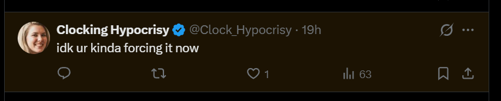
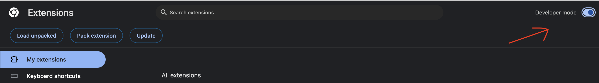
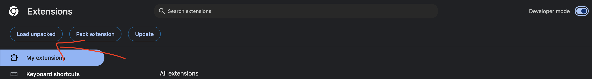

# X Hidden Replies Revealer

A small browser extension that shows replies hidden by the author on X/Twitter.

Hidden replies appear inline in the conversation with a subtle amber tint.



## Install

Install it from the Chrome Web Store:

[X Hidden Replies Revealer](https://chromewebstore.google.com/detail/x-hidden-replies-revealer/lhmmcdgilclllpcmddiollnhjilifmaa)

Manual install:

1. Download or clone this repository.
2. Open `chrome://extensions` in Chrome, Edge, or Brave.
3. Turn on **Developer mode**.



4. Click **Load unpacked**.



5. Select the unarchived `x-hidden-replies` folder.

## Use

Open any X/Twitter post that has hidden replies:

```text
https://x.com/<user>/status/<post-id>
```

Hidden replies should appear in the normal reply thread. If you click into one, its replies should appear too.

## Notes

- You must be logged in to X/Twitter.
- The extension only talks to `x.com`/`twitter.com`.
- X updates can occasionally break extensions like this, so reload the extension after updating.

## Troubleshooting

If replies do not appear:

1. Reload the extension from `chrome://extensions`.
2. Hard-refresh the X/Twitter tab.
3. Open DevTools and check the Console for `[HiddenReplies]` messages.

## Files

```text
manifest.json      Extension manifest
src/inject.js      Finds and inserts hidden replies
src/content.js     Marks hidden reply cells
src/styles.css     Subtle hidden-reply tint
```
